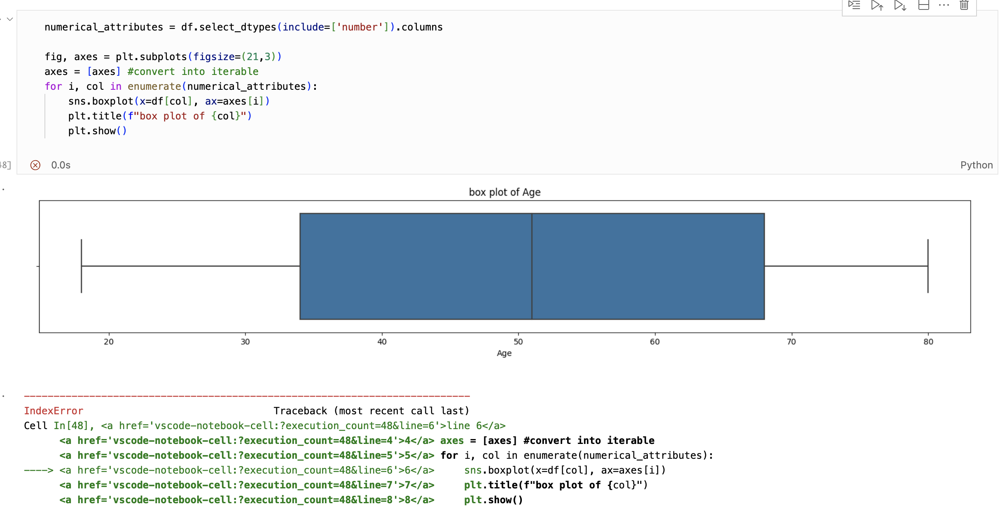
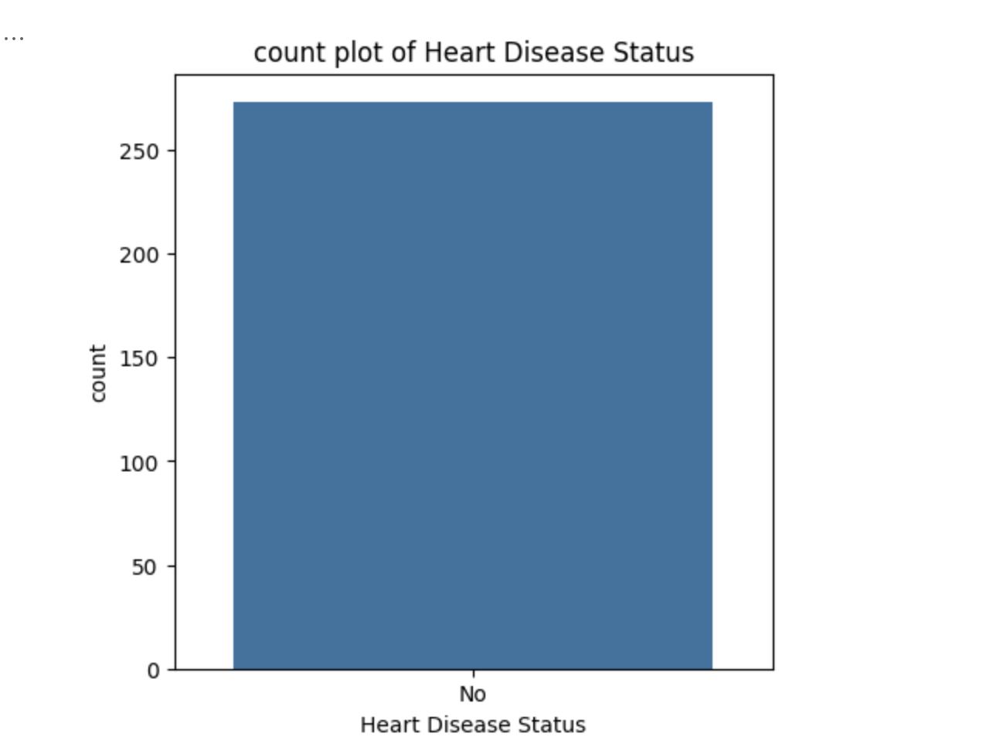

#  

# Heart Disease Data Analytics Project 🫀

**Cardiovascular diseases remain the leading cause of death worldwide each year.**

> According to the World Heart Federation, **"an estimated 80% of cardiovascular diseases... are preventable."** 

This highlights the critical need for preventative strategies in reducing the number of global deaths. In order to address this issue, we must first examine the prevalent risk factors associated with heart disease.

## Project Goal
This goal of this project is to analyse health data to understand the relationship and trends of various risk factors such as _diabetes_, _cholesterol_ and _stress_ in relation to heart disease. 

## Dataset Content

The dataset consists of 21 columns.
| **Attributes**            |     **Attributes**        |     **Attributes**        |
|---------------------------|---------------------------|---------------------------|
| **Age**                       | **Diabetes** (Yes/No)                  | **Sleep Hours** (Hours)              |
| **Gender** (Male, Female, Other)                   | **BMI** (kg/m^2)                       | **Sugar Consumption** (Low, Medium, High)         |
| **Blood Pressure** (mmHg)            | **High Blood Pressure** (Yes/No)       | **Triglyceride Level** (mg/dL)        |
| **Cholesterol Level** (mg/dL)       | **Low HDL Cholesterol** (Yes/No)       | **Fasting Blood Sugar** (mg/dL)       |
| **Exercise Habits** (Low, Medium, High)          | **High LDL Cholesterol** (Yes/No)      | **CRP Level** (mg/L)                 |
| **Smoking** (Yes/No)                  | **Alcohol Consumption** (Low, Medium, high)       | **Homocysteine Level** (µmol/L)        |
| **Family Heart Disease** (Yes/No)      | **Stress Level** (Low, Medium, High)              | **Heart Disease Status** (Yes/No)      |

 

> BMI: Body Mass Index
  
> HDL Cholesterol: A "good" cholesterol that removes "bad" cholesterol from your blood

> LDL Cholesterol: "Bad" cholesterol that increases risk of heart disease

> Triglycerides: Type of fat in blood that increases risk of heart disease

> CRP Level: Protein in the blood that indicates inflammation that can contribute to heart disease

## Business Requirements
### Objectives
#### Primary Goal
This goal of this project is to analyse health data to understand the relationship and trends of various risk factors such as _diabetes_, _cholesterol_ and _stress_ in relation to heart disease. 
#### Intended Outcomes
The intended outcome of this project is for healthcare providers to have a set of actionable insights, regarding risk factors for cardiovascular diseases, that they can then utilise to inform prevention strategies and programmes for patients.

### Target Audience
The target audience of this project includes:
* Medical professionals
* Government healthcare departments
* Patients

### Questions
* Which risk factor is most strongly associated with heart disease?
* What demographic groups are most at risk? (Age, Gender, BMI)
* What are the trends of those diagnosed with heart disease?

## Hypotheses and how to validate?
### Hypothesis 1: Individuals with diabetes are more likely to develop heart disease
#### Visualisation

#### Statistical Test

### Hypothesis 2: Higher cholesterol levels have a positive correlation with heart disease diagnosis
#### Visualisation

#### Statistical Test

### Hypothesis 3: Smokers are more likely to develop heart disease compared to non-smokers
#### Visualisation

#### Statistical Test

### Hypothesis 4: Individuals with a family history of heart disease are more likely to develop heart disease themselves
#### Visualisation

#### Statistical Test

### Hypothesis 5: Individuals with low exercise habits and a higher BMI are more likely to develop heart disease
#### Visualisation

#### Statistical Test

## Project Plan
* Outline the high-level steps taken for the analysis.
* How was the data managed throughout the collection, processing, analysis and interpretation steps?
* Why did you choose the research methodologies you used?

## The rationale to map the business requirements to the Data Visualisations
* List your business requirements and a rationale to map them to the Data Visualisations

## Analysis techniques used
* List the data analysis methods used and explain limitations or alternative approaches.
* How did you structure the data analysis techniques. Justify your response.
* Did the data limit you, and did you use an alternative approach to meet these challenges?
* How did you use generative AI tools to help with ideation, design thinking and code optimisation?

## Ethical considerations
* Were there any data privacy, bias or fairness issues with the data?
* How did you overcome any legal or societal issues?

## Dashboard Design
* List all dashboard pages and their content, either blocks of information or widgets, like buttons, checkboxes, images, or any other item that your dashboard library supports.
* Later, during the project development, you may revisit your dashboard plan to update a given feature (for example, at the beginning of the project you were confident you would use a given plot to display an insight but subsequently you used another plot type).
* How were data insights communicated to technical and non-technical audiences?
* Explain how the dashboard was designed to communicate complex data insights to different audiences. 

## Unfixed Bugs
* Please mention unfixed bugs and why they were not fixed. This section should include shortcomings of the frameworks or technologies used. Although time can be a significant variable to consider, paucity of time and difficulty understanding implementation are not valid reasons to leave bugs unfixed.
* Did you recognise gaps in your knowledge, and how did you address them?
* If applicable, include evidence of feedback received (from peers or instructors) and how it improved your approach or understanding.

## Development Roadmap
### What challenges did you face, and what strategies were used to overcome these challenges?
#### 1. Iteration error with plotting
In [section 1.2.4 Identifying outlier values] I struggled with attempting to iterate through the list of columns and plot on multiple axes.

    * I got around this by simply plotting each box plot seperately. 

#### 2. Sample error
In [section 1.2.4 Identifying outlier values] during the count plot analysis for outliers, it was made apparent that 100% of the data selected had 'No' for heart disease diagnosis 

     * Therefore, I resampled the data using a random state argument to ensure a more representative sample was analysed.

## What new skills or tools do you plan to learn next based on your project experience? 

## Deployment
### Heroku

* The App live link is: https://YOUR_APP_NAME.herokuapp.com/ 
* Set the runtime.txt Python version to a [Heroku-20](https://devcenter.heroku.com/articles/python-support#supported-runtimes) stack currently supported version.
* The project was deployed to Heroku using the following steps.

1. Log in to Heroku and create an App
2. From the Deploy tab, select GitHub as the deployment method.
3. Select your repository name and click Search. Once it is found, click Connect.
4. Select the branch you want to deploy, then click Deploy Branch.
5. The deployment process should happen smoothly if all deployment files are fully functional. Click now the button Open App on the top of the page to access your App.
6. If the slug size is too large then add large files not required for the app to the .slugignore file.

## Main Data Analysis Libraries
* Here you should list the libraries you used in the project and provide an example(s) of how you used these libraries.

## Credits 

* In this section, you need to reference where you got your content, media and extra help from. It is common practice to use code from other repositories and tutorials, however, it is important to be very specific about these sources to avoid plagiarism. 
* You can break the credits section up into Content and Media, depending on what you have included in your project. 

### Content 

- The text for the Home page was taken from Wikipedia Article A
- Instructions on how to implement form validation on the Sign-Up page was taken from [Specific YouTube Tutorial](https://www.youtube.com/)
- The icons in the footer were taken from [Font Awesome](https://fontawesome.com/)

### Media

- The photos used on the home and sign-up page are from This Open-Source site
- The images used for the gallery page were taken from this other open-source site

## Acknowledgements (optional)
* Thank the people who provided support through this project.